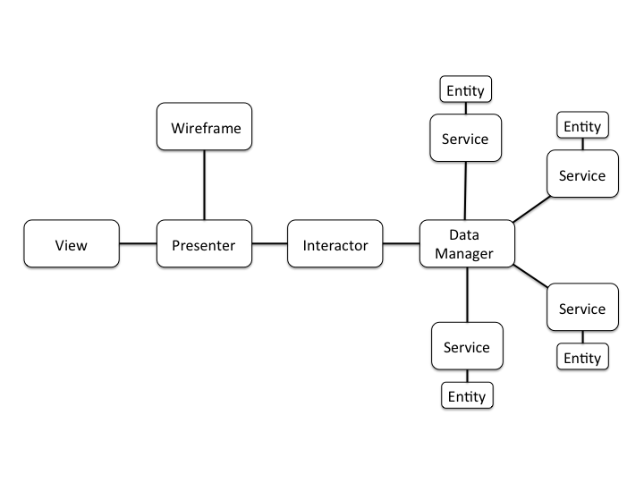
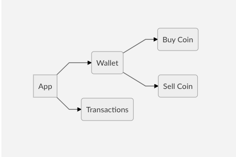

# COIN WALLET - VIPER
> An example Coin Wallet app written in Swift using the VIPER architecture.

[![Swift Version][swift-image]][swift-url]
[![License][license-image]][license-url]

CoinWallet is a conceptual project to manager virtual coins. Its implemented in VIPER architecture. Your use is merely didactic.


## VIPER Arquitecture


**V** — View (displays info to the user and detects user interaction)

**I** — Interactor (manipulates the entities/models by fetching data and storing data)

**P** — Presenter (without use of the UIKit, it contains the UI related business logic and prepares the data for presentation)

**E** — Entity (your model objects)

**R** — Router (aka wireframe, takes care of navigation in your module/application).

More details in  https://www.objc.io/issues/13-architecture/viper/

## Requirements
- Xcode 9.2
- Target to iOS 10.0+

## Installation
1.) Download this project:
```shell
git clone  'https://github.com/souzainf3/CoinWallet-VIPER-ios.git'
```
2.) Install dependencies:
*This project use [CocoaPods](http://cocoapods.org/) to manager dependencies.
See the [CocoaPods](http://cocoapods.org/) website to learn how to install it.*
```ruby
pod install
```
3.) Open `BitcoinWallet.xcworkspace`

## Dependencies
- [RNActivityView](https://github.com/souzainf3/RNActivityView) - UI controls to show activity view
- [Realm](https://github.com/realm/realm-cocoa) - Database
- [Alamofire](https://github.com/Alamofire/Alamofire) - Network Wrapper
- [ObjectMapper](https://github.com/Hearst-DD/ObjectMapper) - Object serialize
- [IQKeyboardManager](https://github.com/hackiftekhar/IQKeyboardManager) - A bit of stewardship

Icons provided by [Icons8](https://icons8.com/). Thanks! :-D


## Features

- [x] Wallet
- [x] Buy Coins
- [x] Sell Coins
- [x] Transaction history
- [x] Persistence
- [x] Unit tests
- [ ] Localized Strings
- [ ] UI tests


## App flow chart



## Author

Romilson Nunes – [@souzainf3](https://twitter.com/souzainf3) | [Github](github.com/souzainf3/) | [Linkedin](https://www.linkedin.com/in/souzainf3/)

This project can not be used for commercial purposes.


[swift-image]:https://img.shields.io/badge/swift-4.0-orange.svg
[swift-url]: https://swift.org/
[license-image]: https://img.shields.io/badge/License-MIT-blue.svg
[license-url]: LICENSE


